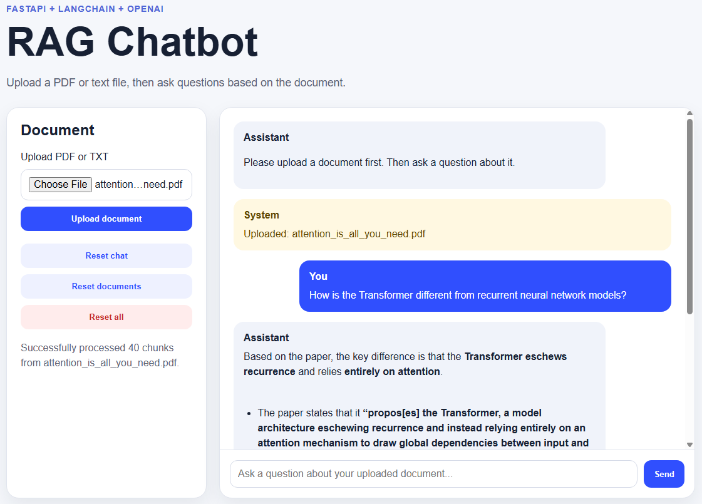

# RAG Chatbot

A local Retrieval-Augmented Generation (RAG) chatbot built with FastAPI, LangChain, OpenAI, and FAISS.

The application allows users to upload a PDF or text file, ask questions about the uploaded document, and receive answers grounded in retrieved document context.

## Screenshot



## Features

- Upload and process PDF or TXT documents
- Split uploaded documents into searchable text chunks
- Store document embeddings in a FAISS vector store
- Retrieve relevant document chunks based on user questions
- Generate document-grounded answers using an OpenAI chat model
- Reset chat history, document knowledge, or both
- Simple web interface built with HTML, CSS, and JavaScript
- API endpoints built with FastAPI
- Automated tests with pytest

## Tech Stack

- Python
- FastAPI
- LangChain
- OpenAI API
- FAISS
- Jinja2
- HTML, CSS, JavaScript
- Pydantic
- pytest
- conda-forge

## Project Structure

```text
rag-chatbot/
├── README.md
├── LICENSE
├── environment.yml
├── requirements.txt
├── pytest.ini
├── .env
├── .env.example
├── .gitignore
├── .vscode/
│   └── settings.json
├── docs/
│   └── images/
│       └── frontend.png
├── src/
│   └── rag_chatbot/
│       ├── __init__.py
│       ├── main.py
│       ├── api/
│       │   ├── __init__.py
│       │   ├── endpoints.py
│       │   └── schemas.py
│       ├── core/
│       │   ├── __init__.py
│       │   └── config.py
│       ├── services/
│       │   ├── __init__.py
│       │   ├── rag_service.py
│       │   ├── chat_engine.py
│       │   └── document_processor.py
│       └── web/
│           ├── __init__.py
│           ├── pages.py
│           ├── templates/
│           │   └── index.html
│           └── static/
│               ├── styles.css
│               └── app.js
└── tests/
    ├── __init__.py
    ├── conftest.py
    ├── test_api_endpoints.py
    ├── test_chat_engine.py
    ├── test_rag_service.py
    ├── test_schemas.py
    └── test_web_pages.py
```

## Setup Options

You can set up this project using either:

1. `conda` with `environment.yml`, recommended if you are using Anaconda or Miniconda.
2. `pip` with `requirements.txt`, useful for standard Python virtual environments.

## Option 1: Setup with conda

### 1. Clone the repository

```bash
git clone https://github.com/your-username/rag-chatbot.git
cd rag-chatbot
```

### 2. Create the conda environment

```bash
conda env create -f environment.yml
conda activate rag-chatbot
```

If the environment already exists and you want to update it:

```bash
conda env update -f environment.yml --prune
conda activate rag-chatbot
```

### 3. Create the environment variables file

For Windows PowerShell:

```powershell
Copy-Item .env.example .env
```

For macOS/Linux:

```bash
cp .env.example .env
```

Then open `.env` and add your OpenAI API settings:

```env
OPENAI_API_KEY=your_openai_api_key_here
OPENAI_MODEL=gpt-4.1-mini
OPENAI_EMBEDDING_MODEL=text-embedding-3-small
OPENAI_TEMPERATURE=0.2

CHUNK_SIZE=1000
CHUNK_OVERLAP=100
RETRIEVAL_K=3
MAX_UPLOAD_SIZE_MB=10
```

Do not commit your real `.env` file to GitHub.

### 4. Run the application

Because this project uses a `src/` layout, set `PYTHONPATH` before running the app.

For Windows PowerShell:

```powershell
$env:PYTHONPATH="src"
python -m uvicorn rag_chatbot.main:app --reload
```

For macOS/Linux:

```bash
export PYTHONPATH=src
python -m uvicorn rag_chatbot.main:app --reload
```

Then open the app in your browser:

```text
http://127.0.0.1:8000
```

## Option 2: Alternative Setup with pip

If you prefer to use `pip` instead of conda, you can create a virtual environment and install the dependencies from `requirements.txt`.

### 1. Clone the repository

```bash
git clone https://github.com/your-username/rag-chatbot.git
cd rag-chatbot
```

### 2. Create a virtual environment

```bash
python -m venv .venv
```

### 3. Activate the virtual environment

For Windows PowerShell:

```powershell
.venv\Scripts\Activate.ps1
```

For macOS/Linux:

```bash
source .venv/bin/activate
```

### 4. Upgrade pip

```bash
python -m pip install --upgrade pip
```

### 5. Install dependencies

```bash
pip install -r requirements.txt
```

### 6. Create the environment variables file

For Windows PowerShell:

```powershell
Copy-Item .env.example .env
```

For macOS/Linux:

```bash
cp .env.example .env
```

Then open `.env` and add your OpenAI API settings:

```env
OPENAI_API_KEY=your_openai_api_key_here
OPENAI_MODEL=gpt-4.1-mini
OPENAI_EMBEDDING_MODEL=text-embedding-3-small
OPENAI_TEMPERATURE=0.2

CHUNK_SIZE=1000
CHUNK_OVERLAP=100
RETRIEVAL_K=3
MAX_UPLOAD_SIZE_MB=10
```

Do not commit your real `.env` file to GitHub.

### 7. Run the application

Because this project uses a `src/` layout, set `PYTHONPATH` before running the app.

For Windows PowerShell:

```powershell
$env:PYTHONPATH="src"
python -m uvicorn rag_chatbot.main:app --reload
```

For macOS/Linux:

```bash
export PYTHONPATH=src
python -m uvicorn rag_chatbot.main:app --reload
```

Then open the app in your browser:

```text
http://127.0.0.1:8000
```

## How to Use

1. Open the web app in your browser.
2. Upload a PDF or TXT document.
3. Wait for the document to be processed.
4. Ask a question about the uploaded document.
5. Use the reset buttons when needed:
   - Reset chat
   - Reset documents
   - Reset all

## API Endpoints

| Method | Endpoint | Description |
|---|---|---|
| `GET` | `/` | Loads the web interface |
| `POST` | `/upload` | Uploads and processes a PDF or TXT document |
| `POST` | `/message` | Sends a user question and returns a RAG response |
| `POST` | `/reset/chat` | Clears conversation history |
| `POST` | `/reset/documents` | Clears uploaded document knowledge |
| `POST` | `/reset/all` | Clears both chat history and document knowledge |

## Running Tests

Run the test suite with:

```bash
python -m pytest
```

The tests cover:

- API upload and message endpoints
- Request and response schemas
- RAG service behaviour
- Chat engine behaviour
- Web page loading
- Reset routes
- File validation logic

## Current Limitations

- Document knowledge is stored in memory and is reset when the app restarts.
- Uploaded documents are not persisted to disk.
- The app currently supports PDF and TXT files only.
- There is no user authentication.
- The FAISS vector store is local and in-memory for this version.
- The chatbot can only answer from uploaded document context.

## License

This project is licensed under the MIT License. See the `LICENSE` file for details.

## Contact

- Name: Ou Yang Yu
- GitHub: https://github.com/gyres
